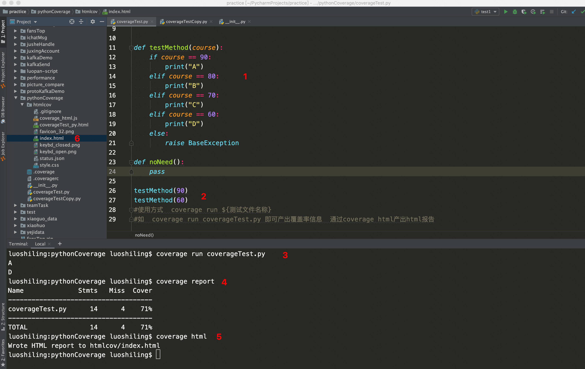

# Python覆盖率框架Coverage初探
## 探索背景
前几天，突然有人在我司覆盖率用户群中，提出个问题，有没有Python版的覆盖率接入方法（我司主要是java），负责的同学发给他一个文档。我想着java版的覆盖率原理不是很了解，python版的了解起来对我来说相对容易些，所以决定去一探究竟。
## 背景知识补充
1. 什么是覆盖率  
测试过程中提到的覆盖率，指的是已测试的内容，占待测内容的百分比，在一定程度上反应测试的完整程度。  
覆盖率有可以根据要衡量的对象细分很多种，比如接口覆盖率、分支覆盖率、行覆盖率等等
2. 做覆盖率有什么用处
根据我以往的经验，覆盖率的好处是可以将测试的完整性量化，可以作为补充测试的手段，也可以在一定程度上佐证测试结果的可靠性。
## Coverage库
下面将介绍Coverage两类主要使用场景：单元测试、功能/自动化测试，对应着Coverage库两种使用方式。  
### 单元测试   
1. 触发   
单元测试使用Coverage命令执行测试单元测试脚本的方式来触发  
  
图片中  
1表示一段待测方法；  
2表示对待测方法发起两次调用；  
3表示使用coverage命令触发测试执行，并记录覆盖率；  
4表示页面化展示覆盖率结果；  
5表示将覆盖率结果导出成html格式报告；  
6表示产出的覆盖率报告
  
如图是最终的报告结果
2. 排除
上述结果如果放到实际工作中会给测试同学产生一些困扰。比如，raise BaseException这种代码在测试过程中由于出现概率极低、很难构造等原因可以无需覆盖，这种代码是希望覆盖率统计时给过滤掉的；
还有一些测试代码也是无需覆盖的，也应该过滤掉。诸如此类，实际工作中会有覆盖范围排除的诉求，下面看下如何使用。
在测试目录的统一级（如上述例子就是coverageTest.py所在位置），新建一个.coveragerc文件，里面加上如下配置：  
[report]  
exclude_lines =  
    raise BaseException  
    def noNeed  
  
这样就可以将不需要的抛异常和测试方法排除掉了，更多用法见文末官方文档。
到这里，就可以根据覆盖率结果来补充测试case，提高覆盖率了。
### 功能/自动化测试
为什么将功能和自动化归为一类呢，是因为这两种都不是运行脚本就可以统计的，而是要在工程运行的过程中，通过手动或自动的方式触发工程代码执行，然后在收集覆盖率数据，接下来以Django项目为例介绍下如何使用（通用于其他wsgi服务器工程）。    
1. 修改wsgi.py文件，更改服务启动逻辑
  
2. 启动服务
python manage.py runserver  
最简单启动方式，实际可根据自身情况加参数
3. 触发工程代码执行，本次实践编写了一个接口去调用
  
4. 收集覆盖率
coverage erase（清除覆盖率数据，避免干扰）  
coverage combine（合并覆盖率数据，可以将多线程的覆盖率结果做合并，实际应用场景很多）  
coverage report （页面化展示覆盖率报告，方便查看是否有覆盖率产生）  
coverage html  （导出html格式报告）  
  
结果如图，出现了很多python库的覆盖率数据，实际只有圈中的文件是我关心的。这个时候就要用到另一种排除参数omit了。  
介绍一下omit和刚刚的排除方式exclude_lines的区别。通过字面意思理解，exclude_lines是排除行，是将正则等方式匹配到的关键字所在行给排除掉。
omit是将文件排除。一个是行级别排除，一个是文件级别排除。  
最终配置如图
  
解释一下其他的参数：
branch = true 表示开启分支覆盖率采集
parallel = true表示开启多线程采集覆盖率
omit 表示要排除的文件，中间用英文,隔开  
踩过的坑：  
include没用，不要用，要划定覆盖范围尽量使用omit
工程中的配置文件.coveragerc有些文章说要放在wsgi.py同级目录下，亲测后发现会导致配置失效，要放到manage.py下（可能和我启动方式有关，因为我使用manage.py启动的，如果用wsgi文件启动，放到wsgi统计下应该是对的）
在项目运行过程中一般同级不到覆盖率，要通过关闭工程的方式来统计，比如CONTROL+C或kill -2，才会确保生成覆盖率数据。  
最后看下最终的覆盖率结果。  
 
branch和partial分别代表这总分支数和覆盖的分支数 
  
以上就是对于coverage的初步探索，文中涉及的用法和命令，参考官方文档说明更详细，推荐去看官方文档。关于实现的原理还在了解过程中，有感兴趣的小伙伴可以一块探讨，文中错误的地方感谢大家纠正。

附参考文档  
coverage官方文档:https://coverage.readthedocs.io/en/latest/index.html  
使用Coverage分析WSGI项目的代码覆盖率:https://segmentfault.com/a/1190000003806169
本文实验工程开源地址:https://github.com/testshiling/coveragePythonTest
